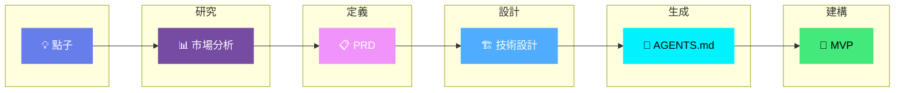

<p align="center">
  
</p>

<h3 align="center">AI 驅動的 MVP 開發</h3>

<p align="center">
  <strong>在幾小時內建立 MVP，而非數月 —— 由 AI 程式碼代理人引導</strong>
</p>

<p align="center">
  <a href="LICENSE"></a>
  <a href="http://makeapullrequest.com"></a>
  <a href="https://github.com/KhazP/vibe-coding-prompt-template/stargazers"></a>
  <a href="https://github.com/KhazP/vibe-coding-prompt-template/issues"></a>
</p>

<p align="center">
  
  
  
  
  
</p>

---

## 工作流 (The Workflow)

透過 5 個 AI 驅動階段，將任何應用點子轉換為可運行的程式碼：



| 階段 | 發生了什麼 | 輸出 | 時間 |
|:-----:|--------------|--------|:----:|
|  | 驗證市場與技術景觀 | `research.txt` | 20 分鐘 |
|  | 明確產品範圍 | `PRD.md` | 15 分鐘 |
|  | 決定如何建構 | `TechDesign.md` | 15 分鐘 |
|  | 將文件轉換為代理人藍圖 | `AGENTS.md` | 10 分鐘 |
|  | 生成與測試程式碼 | **可運行的 MVP** | 1-3 小時 |

---

<p align="center">
  <a href=".claude/README.md">
    
  </a>
</p>

---

## 快速開始

### 運作方式

```
┌─────────────────────────────────────────────────────────────────┐
│  1. 複製提示文件  →  2. 回答問題  →  3. 獲得文件                  │
│  4. 將文件餵給 AI 代理人  →  5. 發佈你的 MVP                     │
└─────────────────────────────────────────────────────────────────┘
```

| 步驟 | 你要做什麼 | 結果 |
|:----:|-------------|--------|
| 1 | 複製 `part1-deepresearch.md`，回答問題 | 研究文件 |
| 2 | 複製 `part2-prd-mvp.md`，回答問題 | PRD 文件 |
| 3 | 複製 `part3-tech-design-mvp.md`，回答問題 | 技術設計文件 |
| 4 | 複製 `part4-notes-for-agent.md`，生成配置 | AGENTS.md + 配置 |
| 5 | 告訴你的 AI 代理人：*"閱讀 AGENTS.md 並建構 MVP"* | **可運行的 MVP** |

> **自動化替代方案：** 嘗試 [Vibe-Coding 網頁應用](https://vibeworkflow.app/#/vibe-coding) 來跳過手動複製貼上。

---

## 前置條件

###  AI 平台（擇一）

用於研究與規劃階段（第 1-4 部分）：

| 平台 | 最適合 | 連結 |
|----------|----------|------|
|  | 技術準確性與推理 | [claude.ai](https://claude.ai) |
|  | 大上下文用於全面研究 | [aistudio.google.com](https://aistudio.google.com) |
|  | 迭代式研究 | [chat.openai.com](https://chat.openai.com) |

###  AI 程式碼代理人（擇一）

用於建構階段（第 5 部分）：

<table>
<tr>
<td width="33%">

**基於終端機**
| 工具 | 描述 |
|------|-------------|
|  | 具備專案感知與會話記憶的 CLI |
|  | 免費、開源的終端機代理人 |

</td>
<td width="33%">

**基於 IDE**
| 工具 | 描述 |
|------|-------------|
|  | AI 編輯器，讀取 `AGENTS.md` |
|  | + GitHub Copilot 或 Cline |
|  | 代理人優先的 IDE |

</td>
<td width="33%">

**無程式碼 (No-Code)**
| 工具 | 描述 |
|------|-------------|
|  | 全端建構器 |
|  | UI 組合 |

</td>
</tr>
</table>

###  基本需求

- 任何現代瀏覽器
- 2-4 小時的時間
- 基本電腦技能（不需要程式能力）
- 選配：用於基於終端機工具的 Node.js

---

## 5 步驟工作流

###  深度研究

<details>
<summary><b>透過 AI 驅動的市場研究驗證你的點子</b> — 20-30 分鐘</summary>

**這個階段做什麼：** 分析市場機會、競爭對手與技術可行性。

**運作方式：**
1. 複製整個 `part1-deepresearch.md` 檔案
2. 貼入你選擇的 AI 平台（Claude、Gemini 或 ChatGPT）
3. 回答針對你的經驗水平量身定制的 5-6 個問題
4. AI 生成全面的研究報告，包含市場分析、競爭對手分析、技術建議與成本估算
5. 將輸出儲存為 `research-[你的應用名稱].txt`

**提示：** 如果你的平台支援網頁搜索，請啟用它以獲取最新的統計數據與競爭對手資訊。

</details>

###  產品需求 (PRD)

<details>
<summary><b>明確定義你要建構什麼</b> — 15-20 分鐘</summary>

**這個階段做什麼：** 將你的點子轉換為清晰、可執行的產品規格。

**運作方式：**
1. 將 `part2-prd-mvp.md` 複製到新的 AI 對話中
2. 在提示時附上你的研究發現
3. 回答有關核心功能、目標使用者、成功指標與 UI/UX 願景的問題
4. AI 建立專業的 PRD 文件
5. 儲存為 `PRD-[你的應用名稱]-MVP.md`

</details>

###  技術設計

<details>
<summary><b>規劃技術架構</b> — 15-20 分鐘</summary>

**這個階段做什麼：** 決定最佳技術棧與實作方法。

**運作方式：**
1. 將 `part3-tech-design-mvp.md` 複製到新的 AI 對話中
2. 附上你的 PRD（必填）與研究報告（選填）
3. 回答有關平台、複雜度承受能力、預算與時間線的問題
4. AI 建議最佳技術棧（無程式碼、低程式碼或全程式碼）
5. 儲存為 `TechDesign-[你的應用名稱]-MVP.md`

</details>

###  生成 AI 代理人指令

<details>
<summary><b>為你的 AI 程式碼助理建立藍圖</b> — 5-10 分鐘</summary>

**這個階段做什麼：** 將所有文件轉換為 AI 代理人的逐步程式編寫指令。

**運作方式：**
1. 將 `part4-notes-for-agent.md` 複製到新的 AI 對話中
2. 附上 PRD 與技術設計文件
3. 要求 AI 擬定 AGENTS 結構的簡要計畫；審查並批准
4. AI 將生成：
   - `AGENTS.md` — 通用指令
   - 根據你的選擇提供工具特定配置（CLAUDE.md、.cursorrules 等）
5. 將所有檔案儲存在專案根目錄下

**注意：** 將 `AGENTS.md` 與工具配置視為動態文件 —— 隨者專案規模擴大而更新它們。

</details>

###  與 AI 代理人一起建構

<details>
<summary><b>讓 AI 建構你的 MVP</b> — 1-3 小時</summary>

#### 按工具類型設定

**終端機代理人 (Claude Code, Gemini CLI)**
```bash
cd your-project
claude "Read AGENTS.md and build the MVP"
# 或
gemini "Read AGENTS.md and implement"
```

**IDE 工具 (Cursor, VS Code)**
1. 在 IDE 中開啟你的專案資料夾
2. 新增配置文件（.cursorrules 或類似文件）
3. 以此開始：*"閱讀 AGENTS.md 並逐步建構 MVP"*

**無程式碼平台 (Lovable, v0)**
1. 前往平台網站
2. 貼上你的 PRD 內容
3. 說：*"根據規格建構這個 MVP"*

#### 推薦循環

```
┌──────────┐     ┌──────────┐     ┌──────────┐
│   計畫   │ --> │   執行   │ --> │   驗證   │
│  (批准)  │     │ (單一功能)│     │  (測試)  │
└──────────┘     └──────────┘     └──────────┘
      ^                                 │
      └─────────────────────────────────┘
```

#### 有用的提示詞 (Prompts)

| 等級 | 第一個提示詞 |
|-------|--------------|
| **Vibe-coder** | *"閱讀 AGENTS.md 與 agent_docs。先提出計畫，等待批准，然後逐步建構。"* |
| **開發者** | *"審查 AGENTS.md 與架構。提出第一階段計畫，獲得批准，然後使用適當的模式實作。"* |

**後續提示詞：**
- *"已完成什麼，還剩什麼？"*
- *"測試 [功能] 並修復任何問題"*
- *"使其在行動裝置上運作"*
- *"部署到 Vercel/Cloudflare"*

</details>

---

## 最終專案結構

```
your-app/
├── 📁 docs/
│   ├── research-YourApp.txt
│   ├── PRD-YourApp-MVP.md
│   └── TechDesign-YourApp-MVP.md
├── 📁 agent_docs/
│   ├── tech_stack.md
│   ├── code_patterns.md
│   ├── project_brief.md
│   ├── product_requirements.md
│   └── testing.md
├── 📄 AGENTS.md                  # 通用 AI 指令
├── 📄 CLAUDE.md                  # Claude Code 配置（如果使用）
├── 📄 .cursorrules               # Cursor 配置（如果使用）
└── 📁 src/                       # 你的應用程式原始碼
```

---

## 部署

一旦 MVP 建構完成，請部署到以下平台之一：

| 平台 | 最適合 | 免費層級 |
|----------|----------|:---------:|
|  | Next.js, React, 前端應用 | ✓ |
|  | 靜態網站, edge functions | ✓ |

這兩個平台都支援基於 git 的部署 —— 推送你的程式碼，它就會自動部署。

---

## 工具選擇指南

<details>
<summary><b>我應該使用哪些工具？</b></summary>

| 情況 | 推薦工具 |
|-----------|-------------------|
| 完全初學者 |  或  → 即時託管應用 |
| 學習程式編寫 |  或 VS Code 搭配 Copilot |
| 經驗豐富的開發者 |  或 Cursor |
| 預算有限 |  (免費) + VS Code |
| 需要快速產出 MVP | Lovable → 快速原型 |
| 複雜邏輯 | Claude Code → 大型程式庫的會話記憶 |

**何時不應使用這些工具：**
- 原生行動裝置或硬體建置 —— 使用傳統工具鏈
- 受監管的工作負載 (SOC2, HIPAA) —— 使用企業解決方案
- 安全關鍵系統 —— 需要確定的、人工主導的工程

</details>

---

## 常見陷阱

<details>
<summary><b>避免這些錯誤</b></summary>

| 陷阱 | 解決方案 |
|---------|----------|
| 跳過探索工作 | 先執行第一階段的研究提示詞 |
| 讓代理人單獨發佈程式碼 | 在合併前審查差異 (diff) 並執行測試 |
| 未經檢查發佈自動生成的 UI | 在上線前測試無障礙性與安全性 |
| 強迫一個工具處理所有事情 | 混合使用工具 —— IDE + 終端機 + 建構器 |

</details>

---

## 疑難排解

<details>
<summary><b>常見問題的快速修復</b></summary>

| 問題 | 解決方案 |
|---------|----------|
| **"AI 忽略了我的文件"** | 以此開始：*"首先閱讀 AGENTS.md、PRD 與 TechDesign。在編寫程式碼前總結關鍵需求。"* |
| **"程式碼與 PRD 不符"** | 說：*"重新閱讀關於 [功能] 的 PRD 章節，列出驗收標準，然後進行相應重構。"* |
| **"AI 使事情過於複雜"** | 在配置中加入：*"優先考慮 MVP 範圍。提供最簡單的可行實作。"* |
| **"部署失敗"** | 請求：*"逐步檢查部署清單，驗證環境變數，然後執行健康檢查。"* |

</details>

---

## 貢獻

<p align="center">
  <a href="https://github.com/KhazP/vibe-coding-prompt-template/graphs/contributors">
    
  </a>
  <a href="https://github.com/KhazP/vibe-coding-prompt-template/network/members">
    
  </a>
</p>

歡迎 PR 與 Issue！幫助我們改進：
- 回報提示詞問題
- 分享你的成功實例
- 新增工具配置
- 提交使用此工作流建構的 MVP 範例

請參閱 [CONTRIBUTING.md](CONTRIBUTING.md) 了解指導方針。

---

## 許可證

根據 [MIT 許可證](LICENSE) 發佈。

---

<p align="center">
  <strong>建立你點子的最佳時機是昨天。第二好的時機是現在。</strong>
</p>

<p align="center">
  <sub>由 vibe-coding 社群建立</sub>
</p>

<p align="center">
  <a href="#工作流-(the_workflow)">
    
  </a>
</p>
