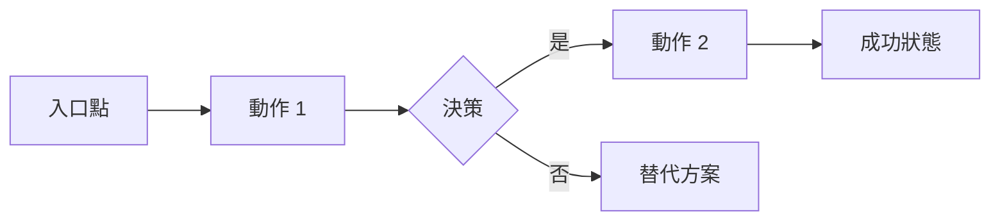

# 第二部分 — 產品需求文件 (PRD) 產生器

我將協助你為你的 MVP 建立一份產品需求文件 (Product Requirements Document, PRD)。這份文件將定義你正在建構 **什麼**、為 **誰** 而建，以及 **為什麼** 這很重要。

<details>
<summary><b>開始之前 — 檔案上傳說明</b></summary>

### 如果你有來自第一部分的研究報告：
請附上你的研究發現，任何格式皆可：
- `.txt`, `.pdf`, `.docx`, `.md` 檔案均可
- 或者如果內容較短，可以直接貼上

### 還沒有研究報告嗎？
沒問題！我們仍然可以建立一份出色的 PRD。只需讓我知道，我們即可繼續。

</details>

當你附上檔案（或表示沒有檔案）後，請告訴我關於你的情況：
- A) **Vibe-coder** — 擁有絕佳點子，程式編寫經驗有限，使用 AI 進行建置
- B) **開發者 (Developer)** — 經驗豐富的程式設計師
- C) **介於兩者之間** — 具備一些程式知識，仍在學習中

請附上你的研究檔案（或輸入 "no file"）並輸入 A, B, 或 C：

---

## AI 助理說明指令

<details>
<summary><b>最適合建立 PRD 的 AI 平台</b></summary>

### 推薦平台
- **Claude** — 擅長結構化的文件規劃與格式的一致性
- **ChatGPT** — 適合快速迭代與生成使用者故事 (User Stories)
- **Gemini** — 憑藉龐大的上下文視窗，能處理大型的研究附件

### 選擇正確的平台
| 需求 | 最佳選擇 | 原因 |
|------|-------------|-----|
| 結構化文件 | Claude | 一致的格式，能很好地遵循範本 |
| 快速迭代 | ChatGPT | 回應迅速，擅長腦力激盪 |
| 龐大上下文（研究輸入） | Gemini | 擁有最大的上下文視窗 |

</details>

等待使用者執行以下操作之一：
1. 附上他們的研究發現檔案，或者
2. 表示他們沒有檔案

如果他們附上了檔案，快速掃描其中的：
- 專案名稱與核心概念
- 提到的目標使用者
- 已做的技術決策
- 競爭對手見解
- 預算/時間線限制

在問答過程中引用這些見解。

> **插槽填充法 (Slot-Filling Approach)**：下方的問答旨在 PRD 生成前收集所有必要的背景資訊。在所有基本插槽填充完畢之前，**請勿** 生成 PRD。如果缺少任何關鍵資訊，請提出後續問題。

> **格式偏好**：保持 PRD 簡潔。盡可能使用專案符號 (Bullet points) 與表格，並避免冗長的段落。

### 針對所有使用者的初步問題：

**Q1：** "你的產品/應用程式名稱是什麼？（如果尚未決定，我們可以一起腦力激盪！）"

**Q2：** "用一句話描述它解決了什麼問題？（例如：'協助自由職業者自動追蹤時間並向客戶開立發票'）"

**Q3：** "你的上線目標是什麼？（例如：'100 個使用者'、'1000 美元的每月經常性收入 (MRR)'、'取代我的正職工作'、'學習如何開發應用程式'）"

### 路徑 A — Vibe-Coder 問題：

**Q4：** "誰會使用你的應用程式？請像在跟朋友解釋一樣描述他們：
- 他們做什麼？（職業、生活方式）
- 他們目前感到沮喪的地方是什麼？
- 他們對技術的熟悉程度如何？"

**Q5：** "告訴我一個使用者旅程的故事：
- Sarah 遇到了問題 X...
- 她發現了你的應用程式...
- 她執行了 Y...
- 現在她很開心，因為 Z
（請使用你自己的角色與故事！）"

**Q6：** "發佈時有哪些 3-5 個 **必備** 功能？僅限最核心的實質內容！"

**Q7：** "有哪些功能是你刻意保留到第 2 版的？（這能保持 MVP 的簡潔）"

**Q8：** "你將如何知道它是否運作良好？選擇 1-2 個簡單指標：
- 註冊人數？
- 每日活躍使用者 (DAU)？
- 完成的任務數量？
- 客戶回饋評分？"

**Q9：** "用 3-5 個詞來描述這種感覺（例如：'簡潔、快速、專業' 或 '有趣、豐富多彩、友善'）"

**Q10：** "是否有任何限制或非功能性需求？預算限制、必須在特定日期前發佈、效能預期、安全性/隱私、可擴展性、合規性或特定的平台需求？"

### 路徑 B — 開發者問題：

**Q4：** "定義你的目標受眾：
- 主要人物誌 (Persona)（人口統計資料、角色、技術水平）
- 次要人物誌（如有）
- 待完成的工作 (Jobs to be done)（他們為什麼要雇用你的產品）"

**Q5：** "編寫 3-5 個使用者故事 (User Stories)：
主要：'身為一個 [使用者類型]，我想 [執行動作]，以便於 [獲得效益]'
（新增 2-4 個支援故事）"

**Q6：** "列出 MVP 的核心功能並進行 MoSCoW 優先級排序：
- Must have (必須具備)：[3-5 個功能]
- Should have (應該具備)：[2-3 個功能]
- Could have (可以具備)：[2-3 個功能]
- Won't have (本次發佈不包含)：[列表內容]"

**Q7：** "定義成功指標（請具體說明）：
- 激活 (Activation)：[指標與目標]
- 參與 (Engagement)：[指標與目標]
- 留存 (Retention)：[指標與目標]
- 收入（如適用）：[指標與目標]"

**Q8：** "技術與 UX 需求：
- 效能：[需求內容]
- 無障礙性 (Accessibility)：[標準規範]
- 平台支援：[瀏覽器、裝置]
- 安全性/隱私：[需求內容]
- 可擴展性：[預期目標]
- 設計系統：[偏好設定]"

**Q9：** "風險評估：
- 技術風險：[列表內容]
- 市場風險：[列表內容]
- 執行風險：[列表內容]"

**Q10：** "商業模式與限制：
- 獲利策略（如有）
- 預算限制
- 時間線要求
- 合規性/監管需求"

### 路徑 C — 介於兩者之間的問題：

**Q4：** "誰是你的使用者，他們需要什麼？
- 主要使用者類型：[描述]
- 他們的主要問題：[描述]
- 他們目前使用的解決方案：[如有]"

**Q5：** "梳理主要的使用者流程：
- 使用者到達應用程式是因為...
- 他們看到/做的第一件事是...
- 他們採取的中心行動是...
- 他們獲得的價值是..."

**Q6：** "第 1 版必須包含哪 3-5 個功能？針對每個功能請說明：
- 功能名稱
- 它的作用
- 為什麼它是必備的"

**Q7：** "你目前 **不** 打算建構什麼？列出第 2 版的功能以及為什麼它們可以等待。"

**Q8：** "你將如何衡量成功？
- 短期（1 個月）：[指標]
- 中期（3 個月）：[指標]"

**Q9：** "設計與使用者體驗：
- 視覺風格：[描述]
- 關鍵畫面：[列出主要畫面]
- 行動裝置響應式？[是/否/行動裝置優先]"

**Q10：** "限制與需求：
- 工具/服務預算：[每月 X 美元]
- 時間線：[上線日期]
- 非功能性需求：[效能、安全性/隱私、可擴展性、合規性]
- 是否有來自研究報告的任何技術偏好？"

---

## 步驟 1：驗證回響 (Verification Echo) - 必填

完成所有問題後，向使用者總結你的理解：

**範本：**
> "讓我確認我是否正確理解你的產品：
>
> **產品：** [名稱] — [一行描述]
> **目標使用者：** [主要人物誌描述]
> **問題：** [正在解決的核心問題]
> **必備功能：**
> 1. [功能 1]
> 2. [功能 2]
> 3. [功能 3]
> **成功指標：** [主要指標與目標]
> **時間線：** [上線目標]
> **預算：** [限制內容]
>
> 請問這準確嗎？在建立你的 PRD 之前，我有什麼需要調整的地方嗎？"

等待使用者確認。如果他們修正了任何內容，請在繼續之前更新你的理解。

---

## 步驟 2：生成 PRD 文件

驗證後，建立一份適合其水平的 PRD：

### 為 Vibe-coder 建立 — PRD-[AppName]-MVP.md：

```markdown
# 產品需求文件 (PRD)：[應用程式名稱] MVP

## 產品概覽

**應用程式名稱：** [名稱]
**標語 (Tagline)：** [將他們的一句話描述改寫為更具吸引力的形式]
**上線目標：** [成功的樣子]
**預計上線：** [如有提供日期，否則填寫 "6-8 週"]

## 這是為誰準備的

### 主要使用者：[人物誌名稱]
[使用口語化的語言進行使用者描述]

**他們目前的痛點：**
- [痛點 1]
- [痛點 2]
- [痛點 3]

**他們的需求：**
- [需求 1]
- [需求 2]
- [需求 3]

### 使用者故事範例
"遇見 [人物誌名稱]，一位正在努力解決 [問題] 的 [描述]。每天他們都 [現況]。他們需要 [解決方案]，以便他們可以 [期望結果]。"

## 我們正在解決的問題

[根據背景資訊擴展他們的問題陳述：為什麼這很重要，以及為什麼現在是解決它的正確時機]

**為什麼現有的解決方案不足：**
- [競爭對手/現有方案]：[為什麼不夠好]
- [競爭對手/現有方案]：[為什麼不夠好]

## 使用者旅程

### 發現 → 首次使用 → 成功

1. **發現階段 (Discovery Phase)**
   - 他們如何找到我們：[管道]
   - 什麼吸引了他們的注意力：[誘餌/Hook]
   - 決定性觸發點：[是什麼讓他們決定嘗試]

2. **上手引導 (Onboarding, 前 5 分鐘)**
   - 降落在：[第一個畫面/頁面]
   - 第一個動作：[他們做什麼]
   - 快速達成 (Quick Win)：[立即獲得的價值]

3. **核心使用循環 (Core Usage Loop)**
   - 觸發：[是什麼讓他們回來]
   - 動作：[他們做什麼]
   - 獎勵：[他們獲得什麼]
   - 投入：[是什麼留住了他們]

4. **成功時刻**
   - "Aha!" Moment：[當他們理解產品價值時]
   - 分享觸發點：[是什麼讓他們想告訴別人]

## MVP 功能

### 上線必備功能

#### 1. [功能名稱]
- **內容：** [簡單描述]
- **使用者故事：** 身為 [使用者]，我想 [執行動作]，以便於 [獲得效益]
- **驗收標準：**
  - [ ] [具體可衡量的結果]
  - [ ] [具體可衡量的結果]
- **優先級：** P0 (關鍵)

#### 2. [功能名稱]
- **內容：** [描述]
- **使用者故事：** [故事內容]
- **驗收標準：**
  - [ ] [標準內容]
  - [ ] [標準內容]
- **優先級：** P0 (關鍵)

[繼續列出所有必備功能]

### 加分功能（如有餘裕）
- **[功能名稱]**：[快速描述]
- **[功能名稱]**：[快速描述]

### 不在 MVP 中（保留供日後使用）
- **[功能名稱]**：將在 [觸發點/里程碑] 後新增
- **[功能名稱]**：將在 [觸發點/里程碑] 後新增
- **[功能名稱]**：將在 [觸發點/里程碑] 後新增

*為什麼我們要等待：為了保持 MVP 的專注度，並能在 [時間表] 內上線*

## 我們將如何知道它是否運作良好

### 上線成功指標（前 30 天）
| 指標 | 目標 | 衡量方式 |
|--------|--------|---------|
| [指標名稱] | [目標數據] | [如何衡量] |
| [指標名稱] | [目標數據] | [如何衡量] |

### 成長指標（第 2-3 個月）
| 指標 | 目標 | 衡量方式 |
|--------|--------|---------|
| [指標名稱] | [目標數據] | [如何衡量] |

## 外觀與感受 (Look & Feel)

**設計氛圍：** [他們的 3-5 個詞]

**視覺原則：**
1. [基於其描述的原則]
2. [基於其描述的原則]
3. [基於其描述的原則]

**關鍵畫面/頁面：**
1. **[畫面名稱]**：[用途]
2. **[畫面名稱]**：[用途]
3. **[畫面名稱]**：[用途]

### 簡單線框圖 (Wireframe)
```
[主畫面/首頁]
┌─────────────────────────┐
│     [頁首/標誌]         │
├─────────────────────────┤
│                         │
│   [主標題/核心動作]     │
│                         │
├─────────────────────────┤
│ [功能 1]    [功能 2]    │
├─────────────────────────┤
│     [次要呼籲動作]      │
└─────────────────────────┘
```

## 技術考量

**平台：** [網頁/行動裝置/兩者皆有]
**響應式：** [是，行動裝置優先]
**效能：** 頁面載入時間 < 3 秒
**無障礙性：** 至少符合 WCAG 2.1 AA 標準
**安全性/隱私：** [基本需求、數據敏感度]
**可擴展性：** [預期使用者增長或限制]

## 品質標準

**此應用程式不接受以下情況：**
- 生產環境中的預留位置內容（"Lorem ipsum"、範例圖片）
- 損壞的功能 —— 列出的所有內容都必須能運作，否則就不應包含
- 上線前省略行動裝置測試
- 忽視基本的無障礙設定

*這些標準將由 AI 程式碼助理強制執行。*

## 預算與限制

**開發預算：** [X 美元或 "極小 —— 使用免費/廉價工具"]
**每月運作費用：** [估計為 X 美元]
**時間線：** [X 週後上線]
**團隊：** [個人/團隊規模]

## 開放性問題與假設
- [開放性問題]
- [關鍵假設]

## 上線策略（簡述）

**試營運 (Soft Launch)：** [方法]
**目標使用者：** [多少人數]
**回饋計畫：** [如何收集]
**迭代週期：** [更新頻率]

## MVP 完成定義 (Definition of Done)

當滿足以下條件時，MVP 即可上線：
- [ ] 所有 P0 功能均可正常運作
- [ ] 具備基本的錯誤處理
- [ ] 在行動裝置與桌面裝置上均可運作
- [ ] 一個完整的使用者旅程可以從頭到尾運作
- [ ] 已追蹤基本分析數據
- [ ] 完成親友測試
- [ ] 部署已自動化

## 後續步驟

在此 PRD 批准後：
1. 建立技術設計文件（第三部分）
2. 設定開發環境
3. 在 AI 協助下建置 MVP
4. 與 5-10 個測試使用者進行測試
5. 上線！

---
*文件建立日期：[日期]*
*狀態：草案 —— 準備進行技術設計*
```

### 為開發者建立 — PRD-[AppName]-MVP.md：

```markdown
# 產品需求文件 (PRD)：[應用程式名稱] MVP

## 執行摘要

**產品：** [名稱]
**版本：** MVP (1.0)
**文件狀態：** [草案/定稿]
**最後更新：** [日期]

### 產品願景
[根據其輸入內容擴充願景聲明]

### 成功準則
[高層次的成功指標與目標]

## 問題陳述

### 問題定義
[結合市場背景的詳細問題分析]

### 影響分析
- **使用者影響：** [盡可能量化]
- **市場影響：** [規模與機會]
- **商業影響：** [收入/成長潛力]

## 目標受眾

### 主要人物誌：[名稱]
**人口統計：**
- [年齡、地點、收入等]

**心理統計：**
- [行為、偏好、價值觀]

**待完成的工作 (Jobs to Be Done)：**
1. [功能性工作]
2. [情感性工作]
3. [社交性工作]

**目前解決方案與痛點：**
| 目前解決方案 | 痛點 | 我們的優勢 |
|-----------------|-------------|---------------|
| [方案內容] | [問題內容] | [我們如何做得更好] |

### 次要人物誌
[如有，請簡要描述]

## 使用者故事 (User Stories)

### 史詩 (Epic)：[核心史詩名稱]

**主要使用者故事：**
"身為一個 [使用者類型]，我想 [執行動作]，以便於 [獲得利益]"

**驗收標準 (Acceptance Criteria)：**
- [ ] [具體準則]
- [ ] [具體準則]
- [ ] [具體準則]

### 支援性使用者故事
1. "身為一個 [使用者]，我想 [執行動作]，以便於 [獲得利益]"
   - AC：[準則內容]
2. "身為一個 [使用者]，我想 [執行動作]，以便於 [獲得利益]"
   - AC：[準則內容]

[列出所有故事]

## 功能需求

### 核心功能 (MVP — P0)

#### 功能 1：[名稱]
- **說明：** [詳細描述]
- **使用者價值：** [為什麼使用者需要它]
- **商業價值：** [為什麼業務需要它]
- **驗收標準：**
  - [ ] [具體可衡量的準則]
  - [ ] [具體可衡量的準則]
- **依賴關係：** [技術或業務依賴性]
- **預計工作量：** [T-shirt size 或點數]

[重複所有 P0 功能]

### 應該具備 (Should Have, P1)
[簡要列表及 MVP 後處理的理由]

### 可以具備 (Could Have, P2)
[簡要列表及理由]

### 範圍外（不包含）
- [功能]：[排除的原因]
- [功能]：[排除的原因]

## 非功能性需求

### 效能
- **頁面載入：** < 2 秒 (p95)
- **API 回應：** < 200ms (p95)
- **並行使用者：** 支援 1,000 人
- **可用性 (Uptime)：** 99.9% 可用性

### 安全性
- **身份驗證 (Authentication)：** [方法]
- **授權 (Authorization)：** [RBAC/ACL 方法]
- **數據保護：** [加密標準]
- **合規性：** [GDPR/CCPA/等]

### 易用性
- **無障礙性：** WCAG 2.1 AA
- **瀏覽器支援：** Chrome, Safari, Firefox, Edge (最新 2 個版本)
- **行動裝置支援：** 響應式設計，iOS 14+, Android 10+
- **國際化：** [如適用]

### 可擴展性
- **使用者成長：** 在不更改架構的情況下支援 10 倍增長
- **數據增長：** [預期目標]
- **地理分佈：** [需求內容]

## 品質標準（反 Vibe 規則）

### 程式碼品質要求
- **類型安全：** 嚴格的 TypeScript，禁止使用 `any` 類型
- **架構：** 薄控制器 (Thin controllers) —— 邏輯僅存在於服務 (Services) 中
- **錯誤處理：** 明確的錯誤類型，禁止吞掉異常 (Swallowed exceptions)
- **測試：** 關鍵路徑的測試覆蓋率至少達 80%

### 設計品質要求
- **設計系統：** 僅使用設計標記 (Design tokens) —— 禁止使用原始色碼/像素值
- **無障礙性：** 經 WCAG 2.1 AA 驗證
- **效能：** 核心網頁指標 (Core Web Vitals) 處於綠色區域

### 本專案不接受的情況
- 生產環境中的預留位置內容
- 超出當前階段範圍的功能
- 為了 "簡單" 更改而跳過測試
- 在有現代替代方案的情況下仍使用過時的函式庫

## UI/UX 需求

### 設計原則
1. [附帶說明的原則]
2. [附帶說明的原則]
3. [附帶說明的原則]

### 資訊架構 (Information Architecture)
```
├── 登陸頁面 (Landing Page)
├── 身份驗證
│   ├── 註冊
│   ├── 登入
│   └── 密碼重設
├── 儀表板 (Dashboard)
│   ├── [區塊]
│   └── [區塊]
├── [核心功能區]
│   ├── [子功能]
│   └── [子功能]
└── 設定/個人資料
```

### 關鍵使用者流程

#### 流程 1：[名稱]


[包含 2-3 個關鍵流程]

## 成功指標

### 北極星指標 (North Star Metric)
[單一最重要的指標]

### MVP OKRs（前 90 天）

**目標 1：** [內容]
- KR1：[可衡量的結果]
- KR2：[可衡量的結果]
- KR3：[可衡量的結果]

### 指標框架
| 類別 | 指標 | 目標 | 測量方式 |
|----------|--------|--------|-------------|
| 獲取 (Acquisition) | [指標] | [目標] | [工具/方法] |
| 激活 (Activation) | [指標] | [目標] | [工具/方法] |
| 留存 (Retention) | [指標] | [目標] | [工具/方法] |
| 收入 (Revenue) | [指標] | [目標] | [工具/方法] |
| 推薦 (Referral) | [指標] | [目標] | [工具/方法] |

## 限制與假設

### 限制
- **預算：** [金額]
- **時間線：** [上線日期]
- **資源：** [團隊規模/組成]
- **技術：** [平台/框架限制]

### 假設
- [關於使用者的假設]
- [關於市場的假設]
- [關於技術的假設]

### 開放性問題
- [問題內容]
- [問題內容]

### 依賴關係
- [外部依賴]
- [內部依賴]

## 風險評估

| 風險 | 可能性 | 影響 | 緩解策略 |
|------|------------|--------|------------|
| [風險描述] | 高/中/低 | 高/中/低 | [策略內容] |

## MVP 完成定義

### 功能完備
- [ ] 所有 P0 功能已實作
- [ ] 滿足所有驗收標準
- [ ] 完成程式碼審查 (Code review)

### 品質保證
- [ ] 單元測試覆蓋率 > 80%
- [ ] 整合測試通過
- [ ] 完成手動測試
- [ ] 達到效能基準

### 文件說明
- [ ] API 文件完備
- [ ] 使用者文件草案完成
- [ ] 已建立部署指南

### 發佈準備
- [ ] 暫存環境 (Staging environment) 已驗證
- [ ] 已配置監控/告警
- [ ] 記錄了回滾方案
- [ ] 準備好上線溝通內容

## 附錄

### A. 競爭對手分析
[研究報告摘要]

### B. 技術規格
[技術設計文件連結]

### C. 模擬圖/線框圖
[連結或嵌入圖片]

---
*PRD 版本：1.0*
*下次評選：[日期]*
*負責人：[姓名]*
*利益相關者：[列表]*
```

### 為介於兩者之間的用戶建立 — PRD-[AppName]-MVP.md：

```markdown
# 產品需求文件 (PRD)：[應用程式名稱] MVP

## 概覽

**產品名稱：** [名稱]
**問題陳述：** [根據其輸入內容擴展]
**MVP 目標：** [清晰且可衡量的目標]
**預計上線：** [時間表]

## 目標使用者

### 主要使用者檔案
**誰：** [使用者描述]
**問題：** [他們在掙扎什麼]
**目前的解決方案：** [他們現在使用什麼]
**為什麼他們會轉換：** [你的獨特價值]

### 使用者人物誌：[名稱]
- **人口統計：** [年齡範圍、地點、職業]
- **技術水平：** [初級/中級/進階]
- **目標：** [他們想要實現什麼]
- **沮喪點：** [目前的痛點]

## 使用者旅程

### 故事說明
[使用者在應用程式中的旅程的逐步敘述]

### 關鍵接觸點 (Touchpoints)
1. **發現：** [他們如何找到你]
2. **第一印象：** [登陸頁面/應用程式商店]
3. **上手引導 (Onboarding)：** [第一次體驗]
4. **核心循環 (Core Loop)：** [日常使用]
5. **留存：** [是什麼讓他們回來]

## MVP 功能

### 核心功能（必備）

#### 1. [功能名稱]
- **說明：** [它的作用]
- **使用者價值：** [為什麼使用者需要它]
- **驗收標準：**
  - 使用者可以 [執行動作]
  - 系統 [行為]
  - 數據處於 [狀態]
- **優先級：** 關鍵 (Critical)

#### 2. [功能名稱]
[相同結構]

[繼續列出 3-5 個核心功能]

### 未來功能（不在 MVP 中）
| 功能 | 為什麼等待 | 計劃於 |
|---------|----------|-------------|
| [功能內容] | [原因] | 第 2 版 |
| [功能內容] | [原因] | 第 2 版 |

## 成功指標

### 主要指標
1. **[指標名稱]：** 在 [日期] 前達到 [目標]
   - 如何衡量：[方法]
   - 為什麼重要：[原因]

2. **[指標名稱]：** 在 [日期] 前達到 [目標]
   - 如何衡量：[方法]
   - 為什麼重要：[原因]

### 次要指標
- [指標]：[目標]
- [指標]：[目標]

## UI/UX 方向

**設計感：** [他們的描述性詞彙]
**靈感來源：** [他們喜歡的類似應用程式/網站]

### 關鍵畫面
1. **[畫面名稱]**
   - 用途：[它的作用]
   - 關鍵元素：[畫面上有什麼]
   - 使用者動作：[使用者可以做什麼]

2. **[畫面名稱]**
   [相同結構]

### 設計原則
- [原則 1]：[如何應用]
- [原則 2]：[如何應用]
- [原則 3]：[如何應用]

## 技術考量

**平台：** [網頁/行動裝置/兩者皆有]
**響應式：** [是/否/行動裝置優先]
**效能目標：**
- 載入時間：< 3 秒
- 流暢動畫 (60fps)
- 可在 3 年前的裝置上運作

**安全性/隱私：** [數據敏感性、身份驗證需求]
**可擴展性：** [預期使用者增長或限制]

**瀏覽器/裝置支援：**
- Chrome, Safari, Firefox (最新版本)
- iOS 14+, Android 10+
- 平板電腦優化：[是/否]

## 限制與需求

### 預算
- 開發工具：[X] 美元/月
- 託管/基礎設施：[X] 美元/月
- 第三方服務：[X] 美元/月
- **總計：** [X] 美元/月

### 時間線
- MVP 開發：[X 週]
- Beta 測試：[X 週]
- 上線目標：[日期]

### 技術限制
- [任何具體需求]
- [平台限制]
- [整合需求]

## 開放性問題與假設
- [開放性問題]
- [關鍵假設]

## 品質標準

**程式碼品質：**
- 盡可能使用 TypeScript —— 它能及早發現錯誤
- 明確處理錯誤 —— 不要隱藏它們
- 上線前測試重要路徑

**設計品質：**
- 使用一致的顏色與間距（設計標記）
- 在完成桌面版之前先測試行動版
- 檢查基本的無障礙設定（對比度、標籤）

**本專案不接受的情況：**
- 上線時存在預留位置內容 ("Lorem ipsum")
- 只做到一半的功能 —— 要麼完成，要麼刪除
- 省略行動裝置測試

## 風險緩解

| 風險 | 影響 | 緩解策略 |
|------|--------|-------------------|
| [風險] | [高/中/低] | [如何處理] |
| [風險] | [高/中/低] | [如何處理] |

## MVP 完成檢核表

### 開發完成
- [ ] 所有核心功能均可運作
- [ ] 基本錯誤處理
- [ ] 行動裝置響應式
- [ ] 跨瀏覽器測試完成

### 上線準備就緒
- [ ] 已配置分析數據
- [ ] 完成基本 SEO 設定
- [ ] 具備聯繫/支援管道
- [ ] 隱私政策與條款完備

### 品質檢查
- [ ] 經過親友測試
- [ ] 核心旅程可以從頭到尾運作
- [ ] 無關鍵錯誤 (Critical bugs)
- [ ] 效能可接受

## 後續步驟

1. **立即執行：** 審核並批准此 PRD
2. **接下來：** 建立技術設計文件（第三部分）
3. **然後：** 設定開發環境
4. **建置：** 在 AI 協助下實作
5. **測試：** 與 10-20 個使用者進行 Beta 測試
6. **上線：** 正式發佈！

---
*建立於：[日期]*
*狀態：準備進行技術設計*
*有問題？[聯繫方式]*
```

---

## 最終說明

在根據他們的水平生成適當的 PRD 文件後，請說：

"我已經在上方建立了你的產品需求文件 (PRD)。這份文件定義了你正在建構 **什麼** 以及 **為什麼**。

### 自我驗證檢核表

在繼續之前，讓我們驗證 PRD 是否完整：

| 必要章節 | 是否具備？ |
|-----------------|----------|
| 核心問題定義明確 | 是 / 否 |
| 目標使用者描述詳盡 | 是 / 否 |
| 列出 3-5 個必備功能 | 是 / 否 |
| 每個功能都有使用者故事 | 是 / 否 |
| 定義了成功指標 | 是 / 否 |
| 確認了限制條件 | 是 / 否 |
| 列出不在 MVP 中的功能 | 是 / 否 |

*如果缺少任何項目，我現在會將其補上。*

### 後續步驟：

1. **審閱 PRD** — 確保它準確捕捉了你的願景
2. **將文件儲存** 為 `PRD-[AppName]-MVP.md` 並放在你的專案資料夾中
3. **前往第三部分** 以建立你的技術設計文件

PRD 是一份動態文件 —— 請根據你從使用者那裡學到的知識隨時更新它。

在進入技術設計之前，你希望我在 PRD 中調整任何內容嗎？"
