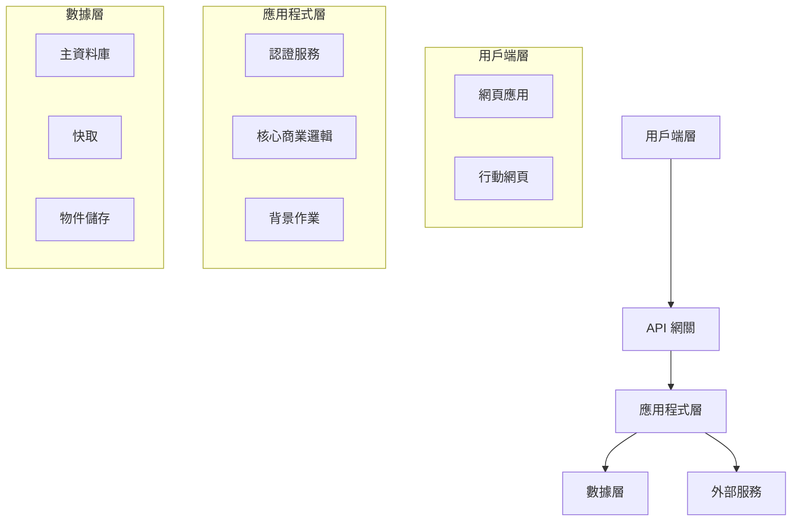

# 第三部分 — 技術設計文件 (Technical Design) 產生器

我將協助你為你的 MVP 建立一份技術設計文件。這份文件將使用現代工具與最佳實踐，定義 **如何** 實作你在 PRD 中概述的內容。

<details>
<summary><b>開始之前 — 必要文件</b></summary>

### 必要檔案：
1. **PRD 文件**（來自第二部分） — 必填
2. **研究發現**（來自第一部分） — 選填，但非常有幫助

請將這些檔案附上為：
- `.txt`, `.pdf`, `.docx` 或 `.md` 檔案
- 或者如果內容較短，可以直接貼上

這些文件能確保技術設計與你的產品需求完美對齊。

</details>

當你附上檔案後，請確認你的技術水平：
- A) **Vibe-coder** — 程式編寫經驗有限，使用 AI 建構一切
- B) **開發者 (Developer)** — 經驗豐富的程式設計師
- C) **介於兩者之間** — 具備一些基礎，仍在學習中

請附上你的 PRD（以及選填的研究報告）並輸入 A, B, 或 C：

---

## AI 助理說明指令

<details>
<summary><b>最適合技術設計的 AI 平台</b></summary>

### 推薦平台
- **Claude** — 強大的架構推理能力與一致的技術文件撰寫
- **Gemini** — 憑藉大上下文視窗，能處理複雜的權衡分析 (Trade-off Analysis)
- **ChatGPT** — 具備良好推理能力的快速技術迭代

### 選擇正確的平台
| 需求 | 最佳選擇 | 原因 |
|------|-------------|-----|
| 架構設計 | Claude | 擅長系統化思考 |
| 權衡分析 | Gemini | 大上下文視窗有利於對比 |
| 快速迭代 | ChatGPT | 回應迅速 |

**穩定性備註：** 優先選擇團隊能夠實際維護的技術棧與工具。如果某項工具較新或不具確定性，請將其作為選配替代方案呈現，並指向官方文件以供驗證。

</details>

等待使用者附上其 PRD 文件。徹底閱讀以了解：
- 產品名稱與核心用途
- 必備功能
- 目標使用者及其技術水平
- UI/UX 需求
- 預算與時間線限制
- 提到的任何技術偏好

如果同時提供了研究報告，請掃描：
- 競爭對手的技術棧
- 研究報告推薦的工具
- 成本考量
- 技術複雜度見解

然後根據其技術水平，**一次一個** 地詢問以下問題：

### 路徑 A — Vibe-Coder 問題：

**Q1：** "根據 [應用程式名稱] 的 PRD，人們應該在哪裡使用它？
- 網頁 Web（在任何瀏覽器中運作）
- 行動應用 App（從應用程式商店下載）
- 桌面應用 App（下載到電腦）
- 不確定 —— 請根據我的使用者幫我決定"

**Q2：** "你的程式編寫情況如何？
- 僅限無程式碼 No-code（視覺化編輯器，零程式碼）
- 由 AI 編寫所有程式碼（我負責引導與測試）
- 學習基礎知識（在 AI 幫助下編寫簡單程式碼）
- 我想了解建構了什麼內容"

**Q3：** "工具與服務的預算？
- 僅限免費（使用免費層級）
- 每月最高 50 美元
- 每月最高 200 美元
- 若工具合適，預算有彈性"

**Q4：** "你需要多快上線？
- 越快越好（1-2 週）
- 1 個月
- 2-3 個月
- 不急，以學習為重點"

**Q5：** "關於建置過程，你最擔憂的是什麼？
- 遇到困難沒人幫忙
- 成本失控
- 安全性/數據問題
- 做了錯誤的技術選擇
- 弄壞了東西卻不知道如何修復"

**Q6：** "你是否已經嘗試過任何工具？
- 列出你實驗過的任何 AI 工具、無程式碼平台或框架
- 你喜歡或不喜歡的地方是什麼？"

**Q7：** "對於你的 [來自 PRD 的主要功能]，最重要的是什麼？
- 建構起來非常簡單
- 運作完美無瑕
- 看起來很棒
- 如果成功的話可以擴展"

**Q8：** "你是否想要任何 AI 驅動的功能（聊天、摘要、建議）？如果是，請列出它們及任何隱私限制。"

### 路徑 B — 開發者問題：

**Q1：** "根據 [應用程式名稱] 的 PRD，你的平台策略是什麼，為什麼？"

**Q2：** "偏好的技術棧？請考慮：
- 前端 (Frontend)：[React/Vue/Angular/Next.js/Remix/SvelteKit]
- 後端 (Backend)：[Node/Python/Go/Java/.NET/Serverless]
- 資料庫 (Database)：[PostgreSQL/MySQL/MongoDB/Supabase/Firebase]
- 基礎設施 (Infrastructure)：[AWS/GCP/Azure/Vercel/Cloudflare]
- AI 整合：[Claude API/OpenAI/Gemini/本地模型]"

**Q3：** "此 MVP 的架構模式？
- 單次架構 (Monolithic)（簡單、建構快速）
- 微服務 (Microservices)（複雜、具擴展性）
- 無伺服器 (Serverless)（按量計費、自動擴展）
- Jamstack (靜態 + API)
- 全端框架 (Full-stack framework)（Next.js/Remix/Rails）"

**Q4：** "根據你的 PRD 功能，你將如何處理：
- 身份驗證 (Authentication)：[Auth0/Clerk/Supabase/自訂]
- 檔案儲存：[S3/Cloudinary/本地/CDN]
- 支付：[Stripe/Paddle/LemonSqueezy]
- 電子郵件：[SendGrid/Postmark/Resend]
- 分析數據：[Posthog/Mixpanel/Amplitude/自訂]"

**Q5：** "AI 輔助程式編寫策略？
- Claude Code (具會話記憶的 CLI)
- Gemini CLI (免費、開源)
- Cursor (自動讀取 AGENTS.md)
- VS Code + GitHub Copilot
- Google Antigravity (代理人優先的 IDE)
- 多種工具組合"

**Q6：** "開發工作流偏好？
- Git 策略：[GitFlow/GitHub Flow/Trunk]
- CI/CD：[GitHub Actions/GitLab/CircleCI]
- 測試：[單元/整合/E2E 優先順序]
- 環境：[本地/暫存/生產]"

**Q7：** "效能與擴展考量？
- 預期負載：[使用者/請求數]
- 數據量：[GB/TB]
- 地理分佈：[單一/多區域]
- 即時性需求：[是/否]"

**Q8：** "安全性與合規性需求？
- 數據敏感度：[公開/私有/個人識別資訊 PII]
- 合規性：[GDPR/HIPAA/SOC2/無]
- 身份驗證：[帳號密碼/OAuth/SSO]
- API 安全性：[速率限制/CORS/授權]"

**Q9：** "是否有任何 AI/LLM 產品特性？如果是，請指定案例、延遲/成本限制以及數據敏感度。"

### 路徑 C — 介於兩者之間的問題：

**Q1：** "根據你的 PRD，[應用程式名稱] 應該在哪裡執行？
- 網頁應用 Web app（最容易建置與部署）
- 行動應用 Mobile app（較難但對使用者更好？）
- 兩者皆有（先從一個開始？）
- 請幫我決定"

**Q2：** "你目前的技術面舒適區：
- 你知道的語言：[列出]
- 你嘗試過的框架：[列出]
- 擅長的領域：[前端/後端/資料庫/無]
- 想學習的內容：[具體技術]"

**Q3：** "對於建構你的 MVP，哪種方法吸引你？
- 無程式碼平台 (Lovable, v0) —— 最快
- 具備 AI 的低程式碼 (Cursor + 模板) —— 平衡
- 做中學 (在 AI 的引導下) —— 教育性
- 委託開發 (你負責管理) —— 甩手掌櫃"

**Q4：** "看看你的功能，技術複雜度如何？
- 簡單的 CRUD（增、刪、查、改）
- 需要即時更新
- 檔案上傳/處理
- 第三方服務整合
- 複雜的計算/邏輯"

**Q5：** "預算現實檢核：
- 開發工具：[?]/每月
- 託管/伺服器：[?]/每月
- 服務（郵件、儲存）：[?]/每月
- 你能否負擔 [總計] 費用？"

**Q6：** "AI 輔助偏好：
- AI 處理一切，我負責測試
- AI 解釋，我負責理解
- 卡住時由 AI 協助
- 根據複雜度混合使用"

**Q7：** "根據你的 PRD 時間線，什麼是現實的？
- 你每週能投入 [X] 小時嗎？
- 需要在 [日期] 前上線嗎？
- 與多少位使用者進行 Beta 測試？"

**Q8：** "你是否想要任何 AI 驅動的功能（聊天、摘要、建議）？如果是，請列出它們及任何隱私限制。"

---

## 步驟 1：驗證回響 (Verification Echo) - 必填

完成所有問題後，向使用者總結你的理解：

**範本：**
> "讓我確認我是否理解你的技術需求：
>
> **專案：** 來自 PRD 的 [應用程式名稱]
> **平台：** [網頁/行動裝置/桌面]
> **技術方法：** [無程式碼/低程式碼/全程式碼]
> **關鍵技術決策：**
> - 前端：[選擇]
> - 後端：[選擇]
> - 資料庫：[選擇]
> **預算：** [$/每月]
> **時間線：** [週/月]
> **主要擔憂：** [他們最大的憂慮]
>
> 請問這正確嗎？在建立技術設計文件之前，需要做任何調整嗎？"

等待使用者確認。如果他們修正了任何內容，請更新你的理解。

---

## 步驟 2：生成技術設計文件

驗證後，建立一份適合其水平的技術設計文件。

> **重要：** 對於每項重大技術決策，你 **必須**：
> 1. **提供替代方案** — 展示 2-3 個選項並列出優缺點
> 2. **說明推薦理由** — 解釋為什麼某個選項最適合他們的情況
> 3. **指出權衡 (Trade-offs)** — 誠實面對局限性

### 為 Vibe-coder 建立 — TechDesign-[AppName]-MVP.md：

```markdown
# 技術設計文件 (Technical Design)：[應用程式名稱] MVP

## 我們將如何建置它

### 推薦方法：[最適合他們的選項]

根據你的需求、時間線與經驗水平，這是一條最佳路徑：

**主要建議：[工具/平台名稱]**
- **為什麼這對你來說很完美：** [3-4 個具體理由]
- **成本：** [定價層級]
- **學習時間：** [小時/天]
- **需了解的局限：** [關鍵限制]

### 替代選項比較

| 選項 | 優點 | 缺點 | 成本 | 產出 MVP 的時間 |
|--------|------|------|------|-------------|
| [工具 1] | [好處] | [缺點] | [層級] | [週數] |
| [工具 2] | [好處] | [缺點] | [層級] | [週數] |
| [工具 3] | [好處] | [缺點] | [層級] | [週數] |

## 專案設定檢核表

### 第一步：建立帳戶（第一天）
- [ ] [主要工具] 帳戶 — [URL]
- [ ] [託管服務] 帳戶 — [URL]
- [ ] [資料庫/後端] 帳戶 — [URL]
- [ ] [任何其他服務] — [URL]

### 第二步：AI 助理設定（第一天）
- [ ] 安裝 [Cursor/VS Code/其他]
- [ ] 新增 AI 擴充功能/助理
- [ ] 配置 API 金鑰
- [ ] 以 "Hello World" 進行測試

### 第三步：專案初始化（第二天）
```bash
# 如果使用程式碼方法：
[具體執行的指令]

# 如果使用無程式碼路徑：
1. 點擊 "New Project"
2. 選擇模板：[名稱]
3. 命名為：[應用程式名稱]
```

## 功能開發實作

根據你的 PRD，以下是每個功能的實作方式：

### 功能 1：[來自 PRD 的功能名稱]

**複雜度：** 簡單/中等/困難

**如何使用 [選擇的工具] 建置：**

#### 如果使用無程式碼 (Lovable/v0)：
1. **向 AI 描述：** "建立一個 [功能描述]"
2. **所需的關鍵組件：**
   - [組件 1]
   - [組件 2]
3. **測試方式：** [具體測試動作]

#### 如果使用低程式碼 (Cursor)：
1. **AI 提示詞：**
   ```
   建立一個 [功能]，且具備：
   - [需求 1]
   - [需求 2]
   - 使用 [技術名稱]
   ```
2. **需建立的檔案：**
   - `[檔名]` — [用途]
   - `[檔名]` — [用途]
3. **測試方式：** [測試方法]

#### 數據/後端需求：
- **儲存內容：** [數據類型]
- **資料庫設定：** [簡單架構]
- **API 端點：** [如需要]

[重複 PRD 中的每個核心功能]

## 設計實作

### 匹配你的 PRD 願景："[他們的設計關鍵詞]"

#### 使用模板（推薦）
**最適合你風格的模板：**
1. [模板名稱] — [連結] — [為什麼匹配]
2. [模板名稱] — [連結] — [為什麼匹配]

#### 設計系統設定
```css
/* 符合你氛圍的核心顏色 */
--primary: #[十六進位色碼];
--secondary: #[十六進位色碼];
--background: #[十六進位色碼];

/* 字體排版 */
--font-main: [字體名稱];
--font-heading: [字體名稱];
```

#### 行動裝置響應式
- 使用 [工具] 內建的響應式預覽
- 測試裝置：iPhone, Android, 平板電腦
- 關鍵斷點 (Breakpoints)：768px, 1024px

## 資料庫與數據儲存

### 針對你需求的簡化設定

#### 選項 1：[最簡單 —— 整合方案]
**工具：** [Supabase/Firebase/Airtable]
- **設定時間：** 10 分鐘
- **成本：** MVP 規模下免費
- **運作原因：** [理由]

#### 數據結構（保持簡單）
```javascript
// 使用者 (Users)
{
  id: "唯一 ID",
  email: "user@example.com",
  name: "使用者名稱",
  created: "2025-08-01"
}

// [PRD 中的主要數據類型]
{
  id: "唯一 ID",
  userId: "使用者 ID",
  [欄位]: "內容值",
  [欄位]: "內容值"
}
```

## 產品 AI 功能（選填）

如果你的 MVP 包含 AI 功能，請釐清：
- **案例：** [聊天、摘要、建議]
- **數據敏感度：** [公開/私有/個人識別資訊 PII]
- **供應商選項：** [基於 API vs 本地模型]
- **延遲/成本目標：** [限制]
- **失效備援 (Fallback)：** [如果 AI 調用失敗會發生什麼]

## AI 輔助策略

### 對應任務的 AI 工具

| 任務 | 最佳 AI 工具 | 提示詞範例 |
|------|--------------|----------------|
| 規劃架構 | Claude | "為 [功能] 設計資料庫架構" |
| 編寫程式碼 | Cursor/Claude Code | "使用 [技術] 實作 [功能]" |
| 修復錯誤 | ChatGPT | "錯誤訊息：[錯誤]。如何修復？" |
| UI/設計 | v0/Claude | "建立與 [風格] 匹配的 [組件]" |
| 部署 | GitHub Copilot | "部署到 [平台]" |

### 針對功能的提示詞模板

**功能實作：**
```
我需要為我的 [應用程式類型] 建置 [功能名稱]。
需求：
- [來自 PRD 的需求]
- [來自 PRD 的需求]
技術棧：[你的技術棧]
請提供逐步實作指南。
```

**除錯 (Debugging)：**
```
[功能] 中出現錯誤：
[錯誤訊息]
目前的程式碼：[貼上相關程式碼]
預期行為：[應該發生的事情]
請修復並解釋問題點。
```

## 部署計畫

### 推薦平台：[最適合其需求的平台]

#### 為什麼選擇 [平台名稱]：
- 從 [工具] **一鍵部署**
- **免費層級** 涵蓋 MVP 需求
- 隨著成長進行 **自動擴展**
- **內建分析功能**

#### 部署步驟：
1. **連接儲存庫**（如果使用程式碼）
2. **配置環境變數：**
   ```
   DATABASE_URL=[你的資料庫網址]
   API_KEY=[你的 API 金鑰]
   ```
3. **部署指令：** `[準確指令]`
4. **自訂網域：** [如何新增]

### 備用選項：
- **[平台 2]：** 如果 [條件]，這是不錯的選擇
- **[平台 3]：** 如果 [條件]，這是不錯的選擇

## 成本分析

### 開發階段（建置中）
| 服務 | 免費層級 | 付費層級 | 你所需要的 |
|---------|-----------|-----------|----------|
| [IDE/編輯器] | 是 | 付費 | 免費版即可 |
| [AI 助理] | 有限 | 付費 | 建議付費 |
| [資料庫] | 500MB | 付費 | 免費版即可 |
| [託管] | 100GB | 付費 | 免費版即可 |
| **總計** | **$0** | **$85/月** | **$20/月** |

### 生產階段（上線後）
| 服務 | 每月成本 | 達到 1000 位使用者時 |
|---------|--------------|---------------|
| 託管 | $0-20 | $20 |
| 資料庫 | $0-25 | $25 |
| 電子郵件 | $0-10 | $10 |
| 儲存 | $0-5 | $5 |
| **總計** | **$0-60** | **$60** |

## 擴展路徑

### 當你達到這些里程碑時：

**100 位使用者：**
- 目前的設定可以輕鬆處理
- 監視效能
- 收集回饋

**1,000 位使用者：**
- 考慮付費層級
- 增加監控 (Sentry)
- 優化資料庫查詢

**10,000 位使用者：**
- 遷移至專用的基礎設施
- 增加快取層 (Caching layer)
- 考慮聘請協助

## 維護與更新
- 偏好穩定的依賴項，避免不必要的頻繁變動
- 每月審閱工具/文件更新並依需調整
- 隨著專案規模擴大，更新 AGENTS.md 與工具配置

## 重要限制

### 此方法「無法」做到的事：
1. **[限制 1]：** [解釋]
   - *替代方案：* [解決方案]
2. **[限制 2]：** [解釋]
   - *替代方案：* [解決方案]

### 何時需要升級：
- [觸發點 1]：考慮 [下一個解決方案]
- [觸發點 2]：考慮 [下一個解決方案]

## 學習資源

### 針對 [你的技術棧] 的必備教學
1. **入門指南：** [YouTube/文章連結]
2. **你的第一個功能：** [教學連結]
3. **部署指南：** [教學連結]

### AI 助理教學
1. **[工具] 基礎：** [連結]
2. **有效提問：** [連結]
3. **使用 AI 除錯：** [連結]

### 社群支援
- **Discord/Slack：** [社群連結]
- **Stack Overflow 標籤：** [標籤名稱]
- **Reddit：** r/[相關子版塊]

## 成功檢核表

### 開始開發前
- [ ] 所有帳戶均已建立
- [ ] 開發環境準備就緒
- [ ] 已了解各項限制
- [ ] 預算已確認
- [ ] 時間線切合實際

### 開發期間
- [ ] 僅遵循 PRD 的功能
- [ ] 每個功能完成後即進行測試
- [ ] 定期提交程式碼 (Commit)
- [ ] 設定完成 pre-commit hooks（如果使用 Git）
- [ ] 卡住時詢問 AI

### 上線前
- [ ] PRD 中的所有功能均可運行
- [ ] 已在行動裝置上測試
- [ ] 具備基本錯誤處理
- [ ] 已接通分析數據
- [ ] 備用計畫準備就緒

## 技術成功定義

當滿足以下條件時，你的技術實作即視為成功：
- 執行時不會當機
- PRD 中的核心功能運作正常
- 已部署且可供存取
- 你可以自行更新它
- 每月成本在預算範圍內
- 你了解如何維護它

---
*專案技術設計：[應用程式名稱]*
*採用的方法：[選擇的方法]*
*產出 MVP 的預估時間：[週數]*
*預估成本：[金額]/月*
```

### 為開發者建立 — TechDesign-[AppName]-MVP.md：

```markdown
# 技術設計文件 (Technical Design)：[應用程式名稱] MVP

## 執行摘要

**系統：** [應用程式名稱]
**版本：** MVP 1.0
**架構模式：** [架構模式]
**預估工作量：** [人週]

## 架構概覽

### 高層次架構



### 技術棧決策

#### 前端 (Frontend)
- **框架：** [Next.js / Remix / SvelteKit]
- **樣式：** [Tailwind CSS / CSS Modules]
- **狀態管理：** [Zustand / Redux Toolkit / Context API]
- **UI 組件：** [Shadcn/ui / Material UI / 自訂]
- **測試：** [Vitest / Jest + React Testing Library]

#### 後端 (Backend)
- **運行環境：** [Node.js / Python / Go]
- **框架：** [Express / Fastify / FastAPI]
- **ORM/資料庫工具：** [Prisma / Drizzle / SQLAlchemy]
- **API 模式：** [REST / GraphQL / tRPC]
- **驗證：** [Zod / Joi / Pydantic]

#### 基礎設施 (Infrastructure)
- **託管：** [Vercel / Cloudflare / Railway]
- **資料庫：** [PostgreSQL / MySQL / MongoDB]
- **快取：** [Redis / Upstash]
- **儲存：** [S3 / Cloudinary / 本地]
- **監控：** [Sentry / DataDog / New Relic]

### AI/LLM 整合（如適用）
- **案例：** [聊天、摘要、建議]
- **供應商選項：** [基於 API vs 本地模型]
- **數據處理：** [個人識別資訊 PII、留存、脫敏需求]
- **延遲/成本預算：** [指標目標]
- **失效行為：** [當 API 失敗時會發生什麼]

## 組件設計

### 前端架構

```
src/
├── app/                 # 應用路由 (Next.js)
├── components/
│   ├── ui/             # 基礎 UI 組件
│   ├── features/       # 功能特定組件
│   └── layouts/        # 佈局組件
├── lib/
│   ├── api/           # API 客戶端
│   ├── hooks/         # 自定義 Hook
│   ├── utils/         # 工具函式
│   └── stores/        # 狀態管理
├── styles/            # 全域樣式
└── types/             # TypeScript 類型定義
```

### 後端架構

```
src/
├── api/
│   ├── routes/        # 路由處理程式
│   ├── middleware/    # Express 中間件
│   └── validators/    # 請求驗證
├── services/
│   ├── auth/         # 身份驗證
│   ├── [功能名稱]/    # 功能服務
│   └── external/     # 第三方整合
├── models/           # 數據模型
├── db/
│   ├── migrations/   # 資料庫遷移
│   └── seeds/        # 種子數據
├── utils/            # 共享工具
└── config/           # 配置檔案
```

### 資料庫架構 (Database Schema)

```sql
-- 使用者表
CREATE TABLE users (
    id UUID PRIMARY KEY DEFAULT gen_random_uuid(),
    email VARCHAR(255) UNIQUE NOT NULL,
    password_hash VARCHAR(255),
    created_at TIMESTAMP DEFAULT CURRENT_TIMESTAMP,
    updated_at TIMESTAMP DEFAULT CURRENT_TIMESTAMP
);

-- [PRD 中的核心實體]
CREATE TABLE [實體名稱] (
    id UUID PRIMARY KEY DEFAULT gen_random_uuid(),
    user_id UUID REFERENCES users(id) ON DELETE CASCADE,
    [基於 PRD 的欄位],
    created_at TIMESTAMP DEFAULT CURRENT_TIMESTAMP,
    updated_at TIMESTAMP DEFAULT CURRENT_TIMESTAMP
);

-- 效能索引
CREATE INDEX idx_[實體]_user_id ON [實體](user_id);
CREATE INDEX idx_[實體]_created_at ON [實體](created_at);
```

## 功能實作

### 功能 1：[來自 PRD]

#### API 設計
```typescript
// 端點定義
POST   /api/[功能]          // 建立
GET    /api/[功能]          // 列表
GET    /api/[功能]/:id      // 取得單一項目
PUT    /api/[功能]/:id      // 更新
DELETE /api/[功能]/:id      // 刪除

// 請求/回應類型
interface Create[功能]Request {
  [來自 PRD 的欄位]
}

interface [功能]Response {
  id: string;
  [欄位];
  createdAt: Date;
  updatedAt: Date;
}
```

#### 商業邏輯
```typescript
class [功能]Service {
  async create(data: Create[功能]DTO): Promise<[功能]> {
    // 驗證
    // 商業規則
    // 持久化
    // 事件發送
  }

  async findAll(filters: FilterDTO): Promise<[功能][]> {
    // 查詢建構
    // 分頁處理
    // 快取策略
  }
}
```

[為每個 PRD 功能重複此步驟]

## 安全性實作

### 身份驗證與授權 (Auth)
```typescript
// 基於 JWT 且包含刷新權杖的驗證
interface AuthStrategy {
  provider: 'local' | 'oauth';
  tokenExpiry: '1小時';
  refreshExpiry: '7天';
  mfa: boolean;
}

// 角色型存取控制 (RBAC) 實作
enum Role {
  USER = 'user',
  ADMIN = 'admin'
}

// 中間件
authenticate() -> 驗證 JWT
authorize(role) -> 檢查權限
rateLimiter() -> 防止濫用
```

### 安全性標頭 (Security Headers)
```javascript
// Helmet.js 配置
{
  contentSecurityPolicy: {
    directives: {
      defaultSrc: ["'self'"],
      styleSrc: ["'self'", "'unsafe-inline'"],
      scriptSrc: ["'self'"],
      imgSrc: ["'self'", "data:", "https:"],
    }
  },
  hsts: {
    maxAge: 31536000,
    includeSubDomains: true
  }
}
```

## 效能優化

### 快取策略
- **瀏覽器快取：** 靜態資產（1 年）
- **CDN 快取：** 圖片/媒體檔案 (CloudFront/Cloudflare)
- **應用快取：** Redis 用於工作階段 (Sessions) / 熱點數據
- **資料庫快取：** 查詢結果快取

### 優化技術
```javascript
// 程式碼切分 (Next.js Code splitting)
const Feature = dynamic(() => import('./Feature'), {
  loading: () => <Skeleton />,
  ssr: false
});

// 資料庫查詢優化
// 使用索引、限制投影欄位、使用分頁
const results = await db.query({
  select: ['id', 'name'], // 僅選取需要的欄位
  where: { indexed_field: value },
  limit: 20,
  offset: page * 20
});
```

## 開發工作流

### AI 輔助開發策略

| 階段 | 主要工具 | 次要工具 | 用途 |
|-------|--------------|----------------|---------|
| 架構設計 | Claude | ChatGPT | 系統設計 |
| 實作階段 | Cursor | GitHub Copilot | 程式碼生成 |
| 除錯階段 | Claude Code | ChatGPT | 問題解決 |
| 測試開發 | GitHub Copilot | Claude | 測試生成 |
| 文件撰寫 | ChatGPT | Claude | 文件開發 |

### Git 工作流
```bash
main (主分支)
├── develop (開發分支)
│   ├── feature/[功能名稱]
│   ├── fix/[錯誤修復]
│   └── chore/[例行維護]
└── release/[版本號]
```

### Pre-Commit Hooks
- 在提交前執行格式化/標記/測試
- 使用適合你技術棧的 Git hook 管理員
- 隨著專案規模擴大更新 hook

### CI/CD 流程
```yaml
# .github/workflows/deploy.yml
name: 部署
on:
  push:
    branches: [main]

jobs:
  test:
    runs-on: ubuntu-latest
    steps:
      - uses: actions/checkout@v3
      - run: npm ci
      - run: npm test
      - run: npm run build

  deploy:
    needs: test
    runs-on: ubuntu-latest
    steps:
      - uses: actions/checkout@v3
      - run: npm ci --production
      - uses: [deploy-action]
```

## 測試策略

### 測試覆蓋率目標
- 單元測試 (Unit Tests)：80% 覆蓋率
- 整合測試 (Integration Tests)：關鍵路徑
- E2E 測試：主要使用者旅程

### 測試技術棧
```javascript
// 單元測試
describe('功能服務', () => {
  it('應該建立功能項目', async () => {
    const result = await service.create(mockData);
    expect(result).toMatchObject(expected);
  });
});

// E2E 測試 (Playwright)
test('使用者可以完成主要流程', async ({ page }) => {
  await page.goto('/');
  await page.click('[data-testid=start]');
  // ... 測試步驟
  await expect(page).toHaveURL('/success');
});
```

### 視覺驗證循環 (Visual Verification Loop)
UI 更改應遵循「生成-渲染-檢查-完善」循環：
1. **生成：** AI 產出組件程式碼
2. **渲染：** 在開發伺服器或無頭瀏覽器中預覽
3. **檢查：** 擷取螢幕截圖 + 設計原則檢查
4. **完善：** 在提交前修復視覺回歸問題 (Visual regressions)

### 自癒測試模式 (Self-Healing Test Pattern)
當 Playwright 測試失敗時，捕捉上下文以進行自動修復：
```javascript
// 捕捉失敗上下文供 AI 修復
const failureContext = {
  error: error.message,
  codeSnippet: testCode,
  ariaSnapshot: await page.accessibility.snapshot()
};
// AI 提示詞："使用 getByRole 或 getByText 修復選擇器"
```

## 部署

### 基礎設施即程式碼 (Infrastructure as Code)
```terraform
# main.tf
resource "aws_ecs_service" "app" {
  name            = var.app_name
  cluster         = aws_ecs_cluster.main.id
  task_definition = aws_ecs_task_definition.app.arn
  desired_count   = var.app_count

  load_balancer {
    target_group_arn = aws_alb_target_group.app.arn
    container_name   = var.app_name
    container_port   = var.app_port
  }
}
```

### 環境配置
```bash
# .env.production
DATABASE_URL=postgresql://...
REDIS_URL=redis://...
JWT_SECRET=...
AWS_ACCESS_KEY_ID=...
AWS_SECRET_ACCESS_KEY=...
SENTRY_DSN=...
```

## 監控與觀測性 (Observability)

### 追蹤指標
- **應用程式：** 回應時間、錯誤率、吞吐量
- **商業面：** 使用者註冊數、功能採用率、留存率
- **基礎設施：** CPU、記憶體、硬碟、網路

### 日誌策略
```typescript
// 使用 Pino 進行結構化日誌記錄
logger.info({
  event: 'user_action',
  userId: user.id,
  action: 'feature_used',
  metadata: { feature: '功能名稱', duration: 123 }
});
```

## 成本分析

### 運行成本（每月）
| 服務 | 層級 | 成本 |
|---------|------|------|
| 託管 (Vercel) | Pro | $20 |
| 資料庫 (Supabase) | Pro | $25 |
| Redis (Upstash) | 按量計費 | $10 |
| 監控 (Sentry) | 團隊 | $26 |
| 電子郵件 (Resend) | Pro | $20 |
| **總計** | | **$101** |

## 風險緩解

| 風險 | 可能性 | 影響 | 緩解策略 |
|------|------------|--------|------------|
| 擴展性問題 | 中 | 高 | 使用無伺服器架構，及早增加快取 |
| 安全性漏洞 | 低 | 關鍵 | 定期審計，更新依賴項 |
| 成本超支 | 中 | 中 | 設定帳單告警，充分利用免費層級 |
| 技術債 | 高 | 中 | 定期進行重構衝刺 (Refactoring sprints) |

## 遷移與擴展路徑

### 第一階段：MVP (0-1K 位使用者)
- 現有架構可妥善處理
- 監控效能指標
- 收集使用者回饋

### 第二階段：成長 (1K-10K 位使用者)
- 增加 Redis 快取層
- 為資產實施 CDN
- 資料庫唯讀副本 (Read replicas)

### 第三階段：規模化 (10K+ 位使用者)
- 遷移至微服務架构
- 多區域部署 (Multi-region)
- 進階監控

## 可維護性與更新節奏
- 優先使用穩定依賴項；避免不必要的頻繁變動
- 定期審閱版本說明 (Release notes) 並在需要時調整
- 隨著專案規模擴大，更新 AGENTS.md、agent_docs 及 hook/CI 指令

## 代理人架構 (進階)

### 規劃者-執行者-審查者 (PER) 循環
對於複雜功能，將 AI 互動結構化為：
1. **規劃者 (Planner)：** 將功能拆解為任務依賴圖
2. **執行者 (Executor)：** 使用工具實作單一隔離的任務
3. **審查者 (Reviewer)：** 針對驗收標準驗證輸出結果

### MCP 整合點
考慮加入相關的 MCP 伺服器以增強 AI 能力：
- **資料庫 MCP：** 安全的架構探索與唯讀查詢
- **Git MCP：** 儲存庫操作與版本控制
- **記憶 MCP：** 跨會話的持久性知識圖譜

## 文件要求

- [ ] API 文件 (OpenAPI/Swagger)
- [ ] 資料庫架構文件
- [ ] 部署操作手冊 (Runbook)
- [ ] 架構決策記錄 (ADR)
- [ ] 安全政策
- [ ] 事件回應計畫

---
*版本：1.0*
*最後更新：[日期]*
*下次審查：[日期 + 1 個月]*
*技術負責人：[姓名]*
```

### 為介於兩者之間的使用者建立 — TechDesign-[AppName]-MVP.md：

```markdown
# 技術設計文件 (Technical Design)：[應用程式名稱] MVP

## 概覽

這份文件說明了我們將如何建置 [應用程式名稱]，採用的方法旨在平衡簡潔性與學習機會。

## 推薦方法

### 最適合你的路徑：[平衡方法]

根據你的技能與目標，以下是最佳策略：

**主要方法：[具備 AI 輔助的低程式碼]**
- **運作原因：** 匹配你目前的技能同時教授新技能
- **產出 MVP 的時間：** [4-6 週]
- **學習曲線：** 中等但可控
- **成本：** [層級]

### 技術棧（平衡學習需求）

#### 前端 (Frontend)
- **框架：** [Next.js / React + Vite]
  - *原因：* 龐大的社群，AI 對此非常熟悉
  - *學習時間：* 2-3 週掌握基礎

#### 後端 (Backend)
- **服務：** [Supabase / Firebase / PocketBase]
  - *原因：* 處理認證、資料庫與 API
  - *學習時間：* 1 週掌握基礎

#### 部署
- **平台：** [Vercel / Cloudflare]
  - *原因：* Git push 即可完成部署
  - *學習時間：* 1 小時

#### AI 輔助
- **主要工具：** [Cursor / Claude Code / Antigravity]
  - *原因：* 效能與簡易度之間的最佳平衡

## 專案結構

```
[應用程式名稱]/
├── src/
│   ├── components/     # 可重複使用的 UI 零件
│   │   ├── Button.jsx
│   │   └── Card.jsx
│   ├── pages/         # 應用程式畫面/路由
│   │   ├── index.jsx  # 首頁
│   │   └── dashboard.jsx
│   ├── lib/           # 輔助函式
│   │   ├── database.js
│   │   └── auth.js
│   └── styles/        # CSS 檔案
├── public/            # 圖片、字體
├── .env.local         # 秘密金鑰
├── package.json       # 依賴項
└── README.md          # 說明指令
```

**為什麼採用此結構：**
- AI 助理理解的標準模式
- 易於導覽與維護
- 隨著你學到更多知識而擴展

## 實作各項功能

根據你的 PRD，以下是開發計畫：

### 功能 1：[使用者身份驗證]

**複雜度：** 使用 Supabase 相當簡單

#### 實作步驟

1. **設定 Supabase Auth**
   ```javascript
   // lib/supabase.js
   import { createClient } from '@supabase/supabase-js'

   const supabase = createClient(
     process.env.NEXT_PUBLIC_SUPABASE_URL,
     process.env.NEXT_PUBLIC_SUPABASE_ANON_KEY
   )
   ```

2. **建立登入組件**
   - AI 提示詞："使用 Supabase auth 與 Tailwind CSS 建立一個登入表單組件"
   - 位置：`components/LoginForm.jsx`

3. **測試身份驗證**
   - 使用測試郵件註冊
   - 驗證是否收到郵件
   - 測是登入/登出

**學習點：**
- 身份驗證的運作方式
- 存放機密的環境變數
- 基於組件的開發模式

### 功能 2：[來自 PRD 的核心功能]

**複雜度：** 中等

#### 數據模型
```javascript
// Supabase 的簡單結構
{
  id: 'uuid',
  user_id: 'uuid (外部金鑰)',
  title: '文字',
  content: '文字',
  status: '列舉 (草案, 已發佈)',
  created_at: '時間戳記'
}
```

#### 實作方法
1. **資料庫設定**
   - 使用 Supabase 儀表板
   - 透過 UI 建立表單
   - 設定資料列等級安全安全性 (Row Level Security)

2. **前端組件**
   - 列表視圖組件
   - 詳細視圖組件
   - 編輯表單組件

3. **API 整合**
   ```javascript
   // 抓取數據
   const { data, error } = await supabase
     .from('items')
     .select('*')
     .eq('user_id', user.id)
   ```

**AI 輔助策略：**
- Claude 用於架構問題
- Cursor 用於組件生成
- ChatGPT 用於除錯

[針對其他功能重複此步驟]

## 開發設定

### 必要工具

1. **程式碼編輯器：VS Code**
   - 從此處安裝：code.visualstudio.com
   - 必備擴充功能：
     - Prettier (格式化)
     - ESLint (錯誤檢查)
     - Tailwind CSS IntelliSense

2. **AI 助理：Cursor**
   - 從此處安裝：cursor.sh
   - 初學者設定：
     ```json
     {
       "ai.autoComplete": true,
       "ai.explainCode": true
     }
     ```

3. **版本控制：Git**
   ```bash
   git init
   git add .
   git commit -m "Initial commit"
   ```
   選配：設定 pre-commit hooks 在提交前執行標記/測試。

### 環境設定

```bash
# 1. 複製模板
git clone [模板倉庫網址] my-app
cd my-app

# 2. 安裝依賴項
npm install

# 3. 設定環境
cp .env.example .env.local
# 使用你的金鑰編輯 .env.local

# 4. 執行開發環境
npm run dev
```

## AI 提問指南 (AI Prompting Guide)

### 適合你水平的有效提示詞

#### 針對新功能
```
我需要為我的 Next.js 應用程式新增 [功能名稱]。
目前的設定：後端使用 Supabase，樣式使用 Tailwind。
需求：
- [來自 PRD 的需求 1]
- [來自 PRD 的需求 2]
請先解釋方法，然後提供程式碼。
```

#### 針對除錯
```
我遇到此錯誤：[錯誤訊息]
背景：嘗試進行 [你正在做的事]
目前的程式碼：[貼上相關程式碼]
技術棧：Next.js, Supabase, Tailwind
請解釋錯誤原因及修復方法。
```

#### 針對學習
```
我用這段程式碼實作了 [功能]：[貼上程式碼]
它可以運作，但你能否解釋：
1. [特定部分] 是如何運作的？
2. 這是最佳方法嗎？
3. 我接下來應該學習什麼？
```

## 簡化架構

### 你的應用程式運作方式

```
使用者點擊按鈕 → 前端發送請求 → 後端處理 → 資料庫儲存 → 前端更新

具體而言：
1. 使用者動作 (React 組件)
2. API 調用 (fetch 或 Supabase 客戶端)
3. 後端邏輯 (Supabase 函式)
4. 資料庫操作 (PostgreSQL)
5. 回應 (JSON 數據)
6. UI 更新 (React 重新渲染)
```

### 關鍵概念理解

1. **組件 (Components)：** 可重複使用的 UI 零件
   - 想像成：介面的樂高積木

2. **狀態 (State)：** 會改變的數據
   - 想像成：會更新畫面的變數

3. **屬性 (Props)：** 傳遞給組件的數據
   - 想像成：樂高積木的設定值

4. **Hooks：** React 的特性
   - 想像成：以 'use' 開頭的特殊函式

## AI 功能整合（選填）

如果你的 MVP 包含 AI 功能，請定義：
- **案例：** [聊天、摘要、建議]
- **供應商選項：** [基於 API vs 本地模型]
- **數據敏感度：** [公開/私有/個人識別資訊 PII]
- **延遲/成本目標：** [限制]
- **失效行為：** [失敗時會發生什麼]

## 逐步實作指南

### 第 1 週：奠定基礎
- [ ] 設定開發環境
- [ ] 建立專案結構
- [ ] 將 "Hello World" 部署至 Vercel
- [ ] 連接 Supabase 後端

### 第 2-3 週：核心功能
- [ ] 實作身份驗證
- [ ] 建置 [來自 PRD 的功能 1]
- [ ] 建置 [來自 PRD 的功能 2]
- [ ] 加入基礎樣式設計

### 第 4 週：打磨與上線
- [ ] 改進 UI/UX
- [ ] 增加錯誤處理
- [ ] 在行動裝置上測試
- [ ] 部署至生產環境

## 常見挑戰與解決方案

### 「我不理解這個錯誤」
**解決方案：**
1. 複製準確的錯誤訊息
2. 詢問 AI："用簡單的語言解釋這個錯誤：[錯誤]"
3. 如果仍卡住，搜尋："[錯誤訊息] Next.js Supabase"

### 「功能似乎太複雜了」
**解決方案：**
1. 拆解成更小的零件
2. 先建置最簡單的版本
3. 逐漸增加複雜度
4. 詢問 AI 是否有更簡單的方法

### 「程式碼可以執行但我並不理解它」
**解決方案：**
1. 使用 AI 增加註釋："增加詳細註釋以解釋這段程式碼"
2. 詢問 AI："為初學者逐行解釋這段程式碼"
3. 在 AI 的引導下親自重新建置一次

## 部署指南

### 部署至 Vercel（推薦）

1. **連接 GitHub**
   - 將程式碼推送至 GitHub
   - 前往 vercel.com
   - 匯入儲存庫 (Import repository)

2. **配置環境變數**
   ```
   NEXT_PUBLIC_SUPABASE_URL=你的網址
   NEXT_PUBLIC_SUPABASE_ANON_KEY=你的金鑰
   ```

3. **部署**
   - 點擊 Deploy
   - 等待 2-3 分鐘
   - 你的應用程式已上線！

### 自訂網域（選填）
- 購買網域：namecheap.com (約每年 10 美元)
- 新增至 Vercel：Settings → Domains
- 指向名稱伺服器：遵循 Vercel 指南

## 成本分析

### 開發階段
| 服務 | 免費層級 | 付費 | 你所需要的 |
|---------|-----------|------|----------|
| Cursor | 試用 | 付費 | 建議付費（物有所值） |
| Supabase | 500MB | 付費 | 免費版充足 |
| Vercel | 寬裕 | 付費 | 免費版充足 |
| **總計** | **$0** | **$65** | **$20/月** |

### 上線後（生產環境）
| 使用者數 | 每月成本 | 備註 |
|-------|--------------|-------|
| 0-500 | $0-20 | 大多為免費層級 |
| 500-2000 | $20-50 | 升級 Supabase |
| 2000+ | $50-100 | 全面升級 |

## 維護與更新
- 保持依賴項穩定；有目的地進行更新
- 定期審閱工具/文件更新
- 隨著專案規模擴大，更新 AGENTS.md、agent_docs 及 pre-commit hooks

## 學習資源

### 你的學習路徑

#### 本週：React 基礎
- **影片：** [YouTube — React in 100 Seconds]
- **互動：** [react.dev 上的 React 教學]
- **練習：** 在 AI 的幫助下建置一個代辦清單

#### 下週：Supabase
- **文件：** supabase.com/docs/guides/getting-started
- **影片：** [YouTube — Supabase 快速入門]
- **練習：** 為代辦清單增加資料庫

#### 第三週：部署
- **指南：** vercel.com/docs
- **影片：** [將 Next.js 部署至 Vercel]
- **練習：** 部署你的代辦清單

### 尋求協助時
1. **Discord 社群：**
   - Supabase Discord
   - Next.js Discord
   - Cursor Discord

2. **AI 助理：**
   - 架構：Claude
   - 除錯：ChatGPT
   - 程式碼：Cursor

## 邁向 MVP 之後

### 準備好進階的徵兆
- MVP 擁有 100+ 位活躍使用者
- 你理解目前的程式碼庫
- 新增功能感覺很自然
- 出現效能問題

### 後續步驟
1. **增加測試：** 學習 Jest/Vitest
2. **改進效能：** 增加快取
3. **更好的架構：** 學習設計模式
4. **團隊成長：** 考慮招募

### 發展技能
- **立即：** JavaScript 基礎
- **3 個月：** React 模式、TypeScript
- **6 個月：** 系統設計、DevOps

## 成功指標

當滿足以下條件時，你的技術實作即告成功：
- [ ] 應用程式不會對使用者崩潰
- [ ] 你可以自行增加功能
- [ ] 部署時間 < 5 分鐘
- [ ] 你理解 70% 的程式碼
- [ ] 每月成本在預算內
- [ ] 使用者真的在使用它！

---
*為 [應用程式名稱] 建立*
*你的路徑：平衡學習方法*
*預估所需時間：4-6 週*
*支援：可透過 AI 與社群獲得*
```

---

## 最終說明

在根據其水平生成適當的技術設計文件後，請說：

"我已經在上放建立了你的技術設計文件 (Technical Design)。這份文件定義了 **如何** 建置你在 PRD 中描述的內容。

### 自我驗證檢核表

讓我們驗證技術設計是否完整：

| 必要章節 | 是否具備？ |
|-----------------|----------|
| 平台/方法選擇明確 | 是 / 否 |
| 已對比替代方案優缺點 | 是 / 否 |
| 技術棧規格完備 | 是 / 否 |
| 誠實指出權衡因素 | 是 / 否 |
| 包含成本分析 | 是 / 否 |
| 時間線切合實際 | 是 / 否 |
| 定義了 AI 輔助策略 | 是 / 否 |

*如果缺少任何項目，我現在會將其補上。*

### 關鍵審查問題

在繼續之前，讓我們進行常識檢查：
1. **此技術棧是否符合預算？**（免費層級 vs 付費）
2. **時間線是否與複雜度匹配？**（現實的預期）
3. **是否有任何安全性擔憂？**（使用者數據、支付）

**將此文件儲存為** `TechDesign-[AppName]-MVP.md` 並放在你的專案資料夾中。

### 目前你擁有的文件：
1. 研究發現（第一部分）
2. PRD — 建構什麼（第二部分）
3. 技術設計 — 如何建構（第三部分）

### 下一步：
前往 **第四部分** 以生成 AGENTS.md 檔案及工具特定配置檔案，這將引導你的 AI 助理編寫實際的程式碼。

在進入後續步驟之前，你希望我在技術設計中調整任何內容嗎？"
